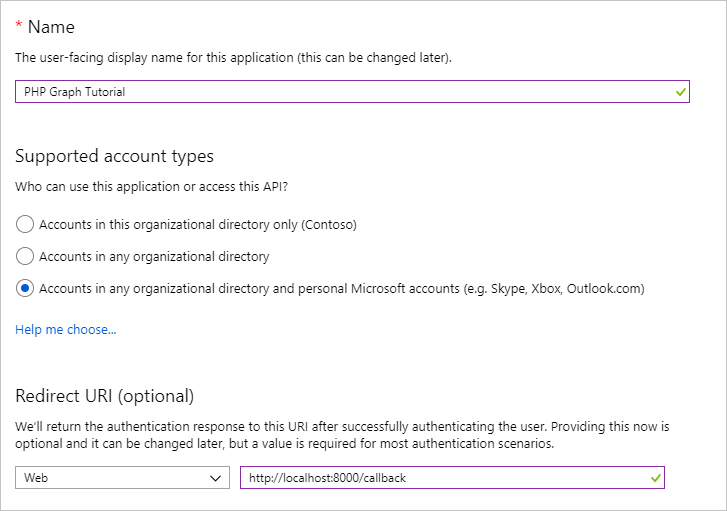
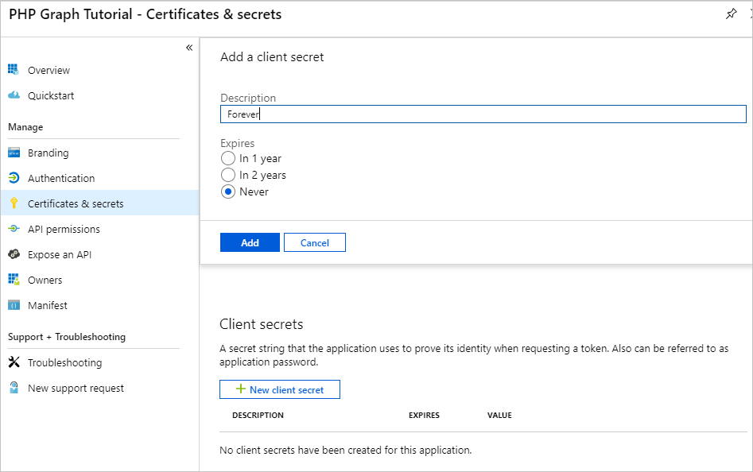

<!-- markdownlint-disable MD002 MD041 -->

In this exercise, you will create a new Azure AD web application registration using the Azure Active Directory admin center.

1. Open a browser and navigate to the [Azure Active Directory admin center](https://aad.portal.azure.com). Login using a **personal account** (aka: Microsoft Account) or **Work or School Account**.

1. Select **Azure Active Directory** in the left-hand navigation, then select **App registrations** under **Manage**.

    

1. Select **New registration**. On the **Register an application** page, set the values as follows.

    - Set **Name** to `PHP Graph Tutorial`.
    - Set **Supported account types** to **Accounts in any organizational directory and personal Microsoft accounts**.
    - Under **Redirect URI**, set the first drop-down to `Web` and set the value to `http://localhost:8000/callback`.

    

1. Select **Register**. On the **PHP Graph Tutorial** page, copy the value of the **Application (client) ID** and save it, you will need it in the next step.

    

1. Select **Certificates & secrets** under **Manage**. Select the **New client secret** button. Enter a value in **Description** and select one of the options for **Expires** and select **Add**.

    

1. Copy the client secret value before you leave this page. You will need it in the next step.

    > [!IMPORTANT]
    > This client secret is never shown again, so make sure you copy it now.

    
